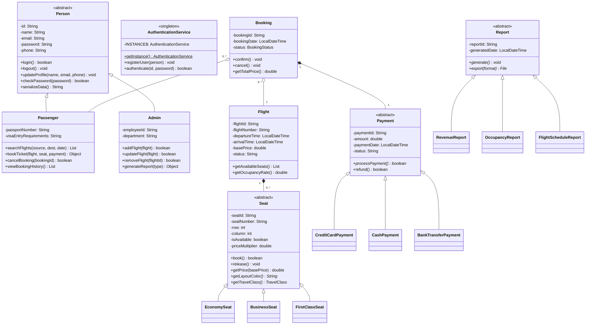

# Airline Reservation System — Project Report & Software Architecture

**Author**: Rahim Rezaie  
**Repository**: `HaiderIkramMaan/AirlineReservation_System`  
**Technology Stack**: Java 25 (OpenJDK), JavaFX 21 (GUI Framework), Custom & JSON File Persistence, Git  

---

## 1. Executive Summary
The **Airline Reservation System** is a desktop application designed to manage airline operations, flight scheduling, user identity management, seat reservations, ticket issuance, payment processing, and administrative analytics. Built using Java 25 and JavaFX 21, the system demonstrates modern object-oriented software engineering principles including **Abstraction**, **Inheritance**, **Polymorphism**, **Encapsulation**, and established design patterns (**Singleton**, **Model-View-Controller**, **Data Serialization**).

---

## 2. System Requirements & Functional Scope

The system is organized into three major functional categories:

### Category 1: Authentication, User Management & Notifications
- **Identity Hierarchy**: Abstract `Person` base class extended by `Passenger` (passport/visa management, flight search, ticket booking, booking history) and `Admin` (employee ID, department, flight management, administrative record oversight).
- **Authentication Service**: `AuthenticationService` singleton managing user registration, credential verification via `checkPassword()`, and active session tracking.
- **Notification System**: `Notification` class dispatching alerts (`BOOKING_CONFIRMATION`, `FLIGHT_UPDATE`, `CANCELLATION`) linked to recipient `Person` instances.

### Category 2: Flight, Seat & Booking Core
- **Flight Inventory**: `Flight`, `Airline`, `Airport`, and `FlightRegistry` managing flight schedules, seat maps, origins, and destinations.
- **Polymorphic Seat Hierarchy**: Abstract `Seat` class extended by `EconomySeat` ($1.0\times$), `BusinessSeat` ($1.5\times$), and `FirstClassSeat` ($2.5\times$), providing dynamic pricing calculations and visual layout color rendering (`#4CAF50` green, `#2196F3` blue, `#FFD700` gold).
- **Booking & E-Tickets**: `Booking` state engine managing statuses (`PENDING`, `CONFIRMED`, `CANCELLED`) and `Ticket` issuance.

### Category 3: Payments, Reports & Dashboards
- **Polymorphic Payments**: Abstract `Payment` base class with concrete subclasses `CreditCardPayment` (card validation & masking), `CashPayment` (receipt number generation), and `BankTransferPayment` (transaction tracking).
- **Administrative Analytics**: Abstract `Report` base class extended by `RevenueReport`, `OccupancyReport`, and `FlightScheduleReport`.
- **JavaFX Desktop GUI**: Graphical views (`LoginView`, `RegisterView`, `PassengerDashboardView`, `AdminDashboardView`) powered by JavaFX.

---

## 3. Object-Oriented Software Design & Architecture

- **Abstraction**: Base classes (`Person`, `Seat`, `Payment`, `Report`, `FileManager`, `ViewController`) declare abstract contracts without locking concrete subclasses to specific implementations.
- **Polymorphism**:
  - `Seat.getPrice(basePrice)` calculates class-specific prices dynamically.
  - `Payment.processPayment()` executes distinct validation and transaction workflows.
  - `Report.generate()` computes specific analytical metrics (revenue, occupancy rates, chronological flight lists).
- **Encapsulation**: Strict use of private/protected member fields with public accessors/mutators and unmodifiable list views (`Collections.unmodifiableList()`).
- **Interfaces & Serialization**: Generic `DataSerializer<T>` interface establishing standardized JSON serialization contracts (`serializeData()`, `deserializeData()`).
- **Design Patterns**:
  - **Singleton Pattern**: Applied in `AuthenticationService` and `FlightRegistry` to ensure a single, thread-safe central registry for users and flight inventory.
  - **Model-View-Controller (MVC)**: Decoupling of domain models (`flight`, `seat`, `booking`, `person`), UI views (`ui/`), and controller logic (`controller/`).

---

## 4. Class Diagram & System Architecture

---

## 5. File Persistence & Data Schema

Data persistence is managed by `FileManager` saving structured JSON files to the `data/` directory:
- **`users.json`**: Stores user profiles (Passenger/Admin) serialized via `serializeData()`.
- **`flights.json`**: Stores flight schedules, airline assignments, origin/destination airports, and seat configurations.
- **`bookings.txt`**: Persists passenger booking records and statuses.

---

## 6. Verification & Demonstration Results

The application includes sample data initialization in `Main.java` seeding:
- **Demo Users**: Passenger (`john.doe@example.com` / `securePass123`) and Admin (`alice.admin@airline.com` / `adminPass456`).
- **Airlines & Airports**: Acme Air, SkyJet, Gulf Wings operating across JFK, LHR, DUB, LAX, SFO, DXB, KHI, ISB, DOH, FRA.
- **Interactive GUI**: Native JavaFX desktop application launching with login, flight search, seat map selection, and administrative reporting dashboards.

---

## 7. Conclusion

The Airline Reservation System successfully delivers a robust, modular, and maintainable software architecture. By leveraging OOP design patterns and JavaFX, the application provides an extensible codebase ready for future database integration and real-world deployment.
